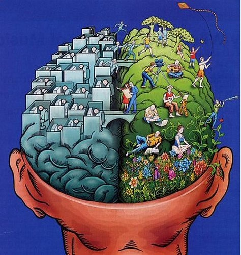

# I. The Latera Handbook

## 1. For whom this handbook is and how to use it

Imagine your company as a vehicle – You want everyone in the organization being able, not only to drive, but also to maintain.

You want to work collaboratively and share ownership, because you want this organization to ‚run on it’s own‘ – like a living organism, like an ecosystem.

Therefor you need a handbook: a comprehensive, understandable and motivational manual on how your organization works.

_What are the key ways that you want to use this document? A few possibilities are_

* _Help in recruiting value aligned talent_
* _Help people decide if they’re a good fit in your organization_
* _Share a sense of belonging for those already in or joining the organization_

\_\_

* _How can we be conscious about the language that we choose?_
  * _Employee vs. partner_
  * _Policy vs. agreement_

\_\_

* Focus on the sections that are going to have the biggest impact on your goals

_Read_ [_suggestions_](https://docs.google.com/document/d/16IJcS7gCuULypz8LHwtW92StOeKzwY718IxH6QdGSDg/edit?ts=5be719b8) _for working on handbooks_

## 2. The idea and the value of Latera

Latera is a Learning Innovation Organisation that promotes creative learning and ethical AI.

Latera's main fields of operation are:

* Development center for digital apps that provide design capacity of digital platforms  
* A magazine and that promotes creative/lateral thinking and capacity building to cope with the challenges of the world today.
* A learning community for creative/lateral __thinking and creative action.

**About lateral/creative/conceptual thinking** 

## 3. Our story and about founder

## 4. The vision, goals, values and guiding principles

## 

